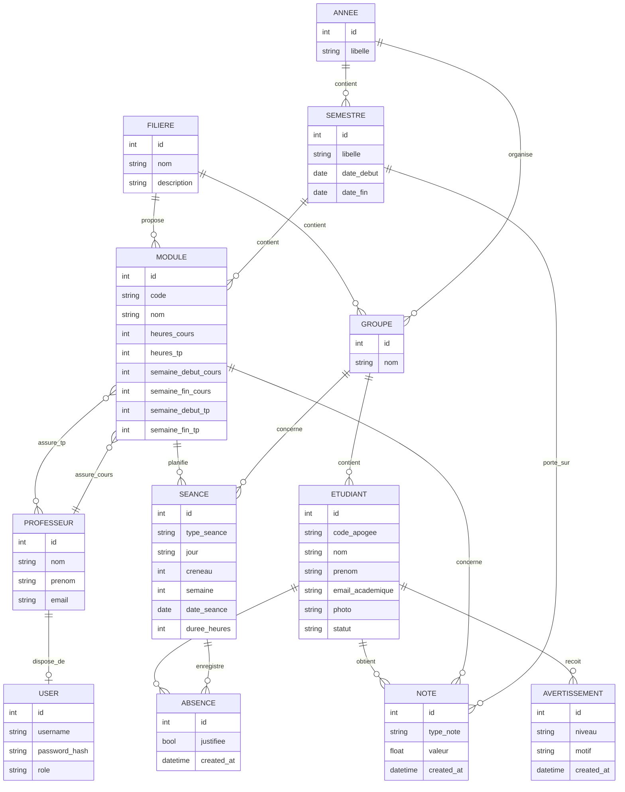

# MCD et MLD

## MCD (vue conceptuelle)

## MLD (vue logique)
- **FILIERE**(`id`, nom, description)
- **ANNEE**(`id`, libelle)
- **SEMESTRE**(`id`, libelle, date_debut, date_fin, `annee_id`)
- **GROUPE**(`id`, nom, `filiere_id`, `annee_id`)
- **PROFESSEUR**(`id`, nom, prenom, email, specialite)
- **USER**(`id`, username, password_hash, role, `professeur_id`)
- **ETUDIANT**(`id`, code_apogee, nom, prenom, email_academique, photo, statut, `groupe_id`)
- **MODULE**(`id`, code, nom, heures_cours, heures_tp, semaine_debut_cours, semaine_fin_cours, semaine_debut_tp, semaine_fin_tp, `semestre_id`, `filiere_id`, `professeur_cours_id`)
- **MODULE_PROFESSEUR_TP**(`module_id`, `professeur_id`)
- **SEANCE**(`id`, type_seance, jour, creneau, semaine, date_seance, duree_heures, `module_id`, `groupe_id`)
- **ABSENCE**(`id`, `etudiant_id`, `seance_id`, justifiee, created_at)
- **NOTE**(`id`, `etudiant_id`, `module_id`, `semestre_id`, type_note, valeur, created_at)
- **AVERTISSEMENT**(`id`, `etudiant_id`, niveau, motif, created_at)

## Justification métier
- Un module appartient à un semestre et à une filière.
- Un groupe appartient à une filière et une année.
- Un étudiant appartient à un seul groupe.
- Une séance correspond à un module + groupe + jour + créneau + semaine.
- Une absence est enregistrée par étudiant et par séance.
- Les notes sont stockées par étudiant, module et semestre.
- Les avertissements sont générés automatiquement selon le nombre d'absences.
